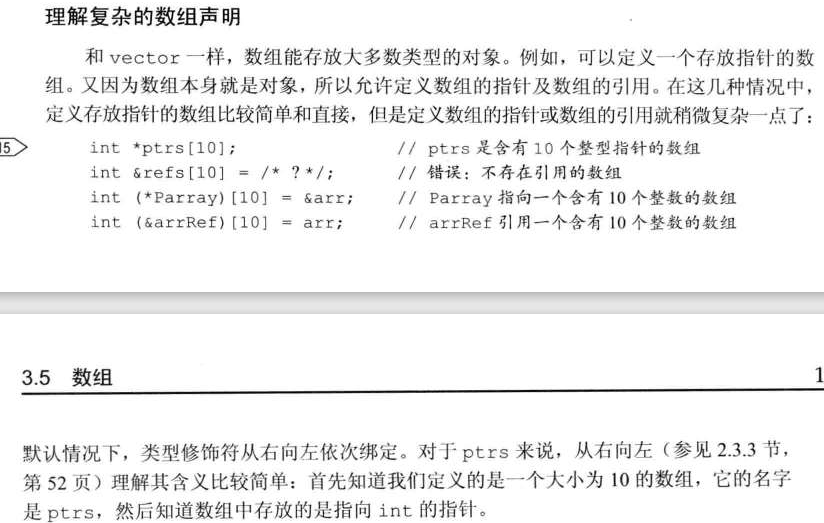
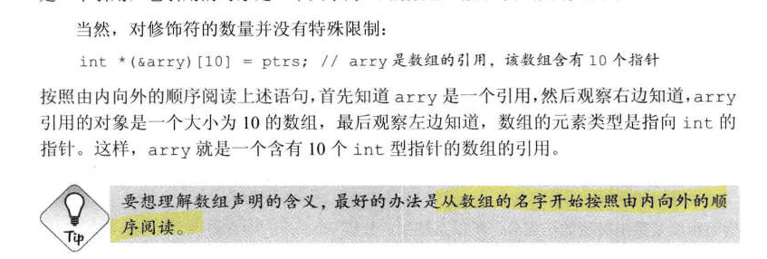
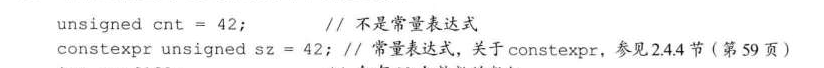
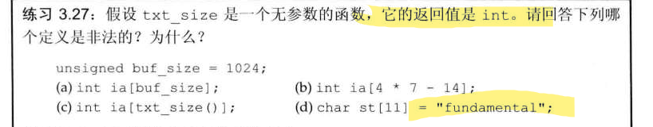
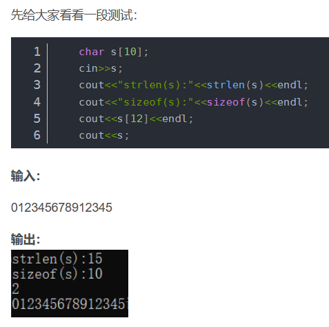
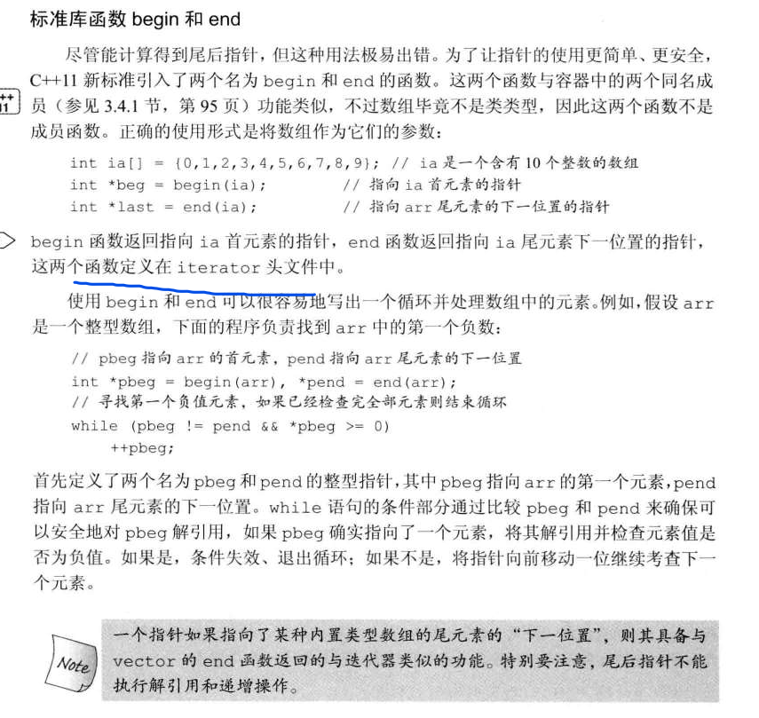
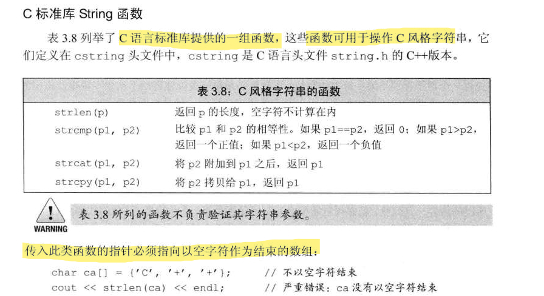
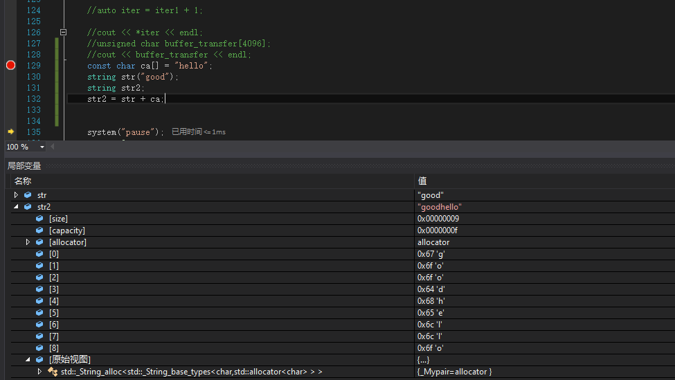
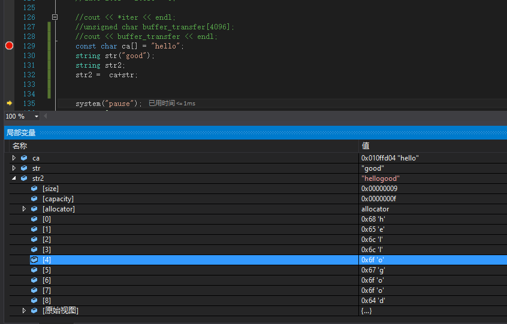
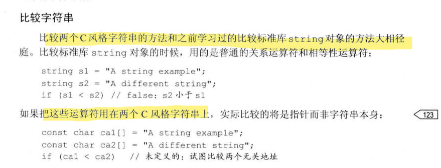

C++

### 指针函数和函数指针

函数指针是指向函数的指针变量，它存储了函数在内存中的起始地址，可以通过函数指针来调用该函数。在回调函数的场景中，通常将一个函数的地址传递给另一个函数作为参数，以便后者在需要时调用前者。这种情况下，需要使用函数指针来完成这个过程。

*// 定义回调函数的函数签名*

typedef void (*Callback)(int);

指针函数是指返回指针类型的函数，它与回调函数的概念不同。虽然指针函数也可以用于回调的场合，但在一般情况下，使用函数指针更加符合语义和惯例。

*// 定义指针函数* 

int* create_array(int size)

## 数组

### 复杂的数组声明

p102

理解里面的每个声明的意思，原则从函数名开始，**从右到左，从内到外**

### 数组的维度一定要是常量表达式

之前这下面判断错了三道

（a）非法，buf_size不是常量表达式  （c）非法，txt_size()函数返回值并不是常量表达式，返回值改为constexpr int  （d）非法，字符串字面值后自带'\0'，超出范围

### 不初始化数组导致的缓冲区溢出

### 直接初始化和拷贝初始化

直接初始化不一定要调用复制构造函数，而复制初始化一定要调用复制构造函数

然而，大多数人却认为，直接初始化是构造对象时要调用复制构造函数，而复制初始化是构造对象时要调用赋值操作函数，这其实是一大误解，因为只有对象被创建时才出现初始化，而赋值操作并不应用于对象的创建过程。至于为什么会出现这个误解，可能是因为复制初始化的写法中存在等号（=）吧。

我们来看个例子

string  str1 = "first";    //拷贝初始化，编译器允许把这句话改写为string str(“first”)，但是string类必须有public的拷贝(移动)构造函数
string  str2(10,'a');     //直接初始化
string  str3(str2);      //直接初始化
string  str4 = string(10,'b');  //拷贝初始化
string  str5 = str4;        //拷贝初始化
string  str6 ("strr");       //直接初始化
如果误解调用拷贝构造函数的就是拷贝初始化，所以可能觉得str3也是拷贝初始化，这样就错了~

直接初始化：

使用普通的函数匹配就可以完成的初始化叫做直接初始化，
也就是说只是直接调用类的构造函数或者拷贝构造函数就能完成初始化的就是直接初始化。
而str2和str3分别调用构造函数和拷贝构造函数，因此它们是直接初始化
拷贝初始化：

将对象拷贝到正在创建的对象中，如果需要还要进行类型转换。
这里也就是间接调用拷贝构造函数，当然大部分情况调用拷贝构造函数，有时也可能调用移动构造函数。
根据上面的例子，我们可能觉得，只有等号"="出现时，才会是拷贝初始化。

其实不然，在下面三个情况下也会发生拷贝初始化。

将一个对象作为实参传递给一个非引用类型的实参(引用作为参数的话就可以省略拷贝这一操作，所以有时候可以这样来优化代码)
从一个返回类型为非引用的函数返回一个对象
花括号初始化一个数组的元素或一个聚合类（struct）的成员
————————————————
原文链接：https://blog.csdn.net/zhizhengguan/article/details/114951840

数组的首尾获取迭代

## 运算符

**->箭头运算符**，综合了解引用运算符和点运算符

a->b等价于(*a).b

**指针不能相加**

两个指针相减表示两个指针相距的距离。但是两个指针相加并没有任何逻辑上的意义，因此两个指针不能相加

## 字符串

### 分清楚标准库的string字符串类型和C风格的字符串类型

C风格的字符串类型已空字符结尾\0

1.注意下面有个C风格字符串的操作例子，这些函数如果没有以\0结尾，会错

2.标准库的string类型对象能够使用+运算符连接，但是C风格的不行，这是表示一个指针（char p[]）

但是如果加号任意一边有一个string对象就可以，而且运算时C风格字符串会被转化为string类型，空字符串会被消除

3.比较字符串

4.string类型和C风格字符串类型的转化

string str(“hello”);****

**这里一定要注意的是返回的指针是指向str的地址的，const是为了这个数组不能反向的去改变原来string类型的值，但是如果string自己改变了值，那么这个返回的C风格数组指针指向的内容也变了，所以，如果想返回的这些数据可以单独使用，最好将数据拷贝后再使用。**

const char* mystr = str.c_str()，在这里**注意要加上const**，因为c_str()返回的是const char *类型
