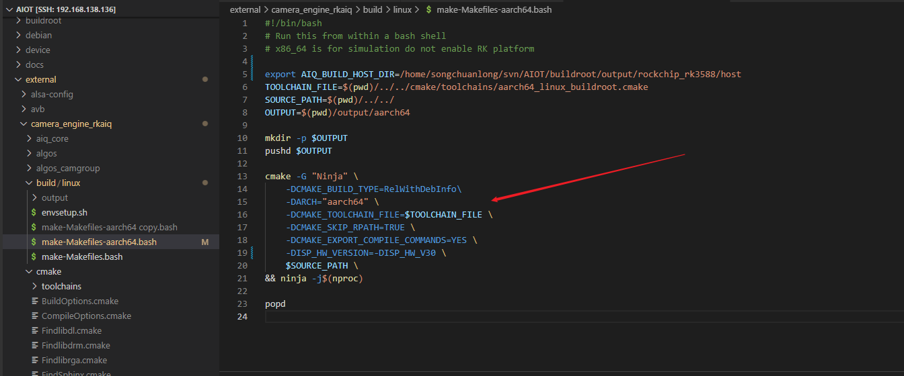
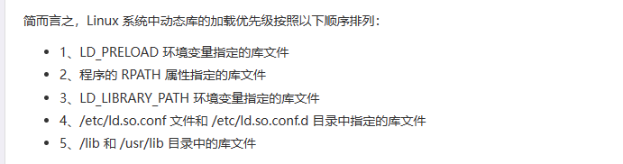

## 构建

Cmake

cmake 是构建makefile用的，执行还是用的make

mkdir build 

cd build 

cmake .. 

make


添加交叉编译

可以参考现成的sdk里面给好的cmakelist.txt

使用file命令可查看文件属性


## cmake命令

下面cmake后面接的这些选项是宏，cmake的宏，可以在命令行指定，也可以在CMakeLists.txt里面用的set()指定




## add_subdirectory

出现这个命令证明CMakeLists.txt的编译命令不是全在本文件，add_subdirectory这个文件夹下面还有CMakeLists.txt


**命令格式**

> `add_subdirectory` (source_dir [binary_dir] [`EXCLUDE_FROM_ALL`])
>  **添加一个子目录并构建该子目录。**

**命令解析**

- **`source_dir`**
   **必选参数**。该参数指定一个子目录，子目录下应该包含`CMakeLists.txt`文件和代码文件。子目录可以是相对路径也可以是绝对路径，如果是相对路径，则是相对当前目录的一个相对路径。
- **`binary_dir`**
   **可选参数**。该参数指定一个目录，用于存放输出文件。可以是相对路径也可以是绝对路径，如果是相对路径，则是相对当前输出目录的一个相对路径。如果该参数没有指定，则默认的输出目录使用`source_dir`。
- **`EXCLUDE_FROM_ALL`**
   **可选参数**。当指定了该参数，则子目录下的目标不会被父目录下的目标文件包含进去，父目录的`CMakeLists.txt`不会构建子目录的目标文件，必须在子目录下显式去构建。`例外情况：当父目录的目标依赖于子目录的目标，则子目录的目标仍然会被构建出来以满足依赖关系（例如使用了target_link_libraries）`。


## set_target_properties



第一个属性target是可执行文件的名字，不是project的名字

```bash
set_target_properties(target  PROPERTIES LINK_FLAGS "-Wl,--disable-new-dtags,-rpath,./lib:../lib:/usr/local/neuware/lib64")
```

## 链接

[(138条消息) CMakeList.txt中增加rpath选项_cmakelist rpath_陈 洪 伟的博客-CSDN博客](https://blog.csdn.net/u013171226/article/details/122047692)

## 构建版本

软件项目构建的目标程序为了标识不同的用途，时常会有Debug版本,Release版本等区分；使用cmake构建工具，CMAKE_BUILD_TYPE选项是实现该区分的标准接口。
cmake支持四种构建类型：
Debug；调试版本
Release；正式版本
RelWithDebInfo；既优化又能调试的版本
MinSizeRel；最小体积版本
https://blog.csdn.net/qazw9600/article/details/115267688s