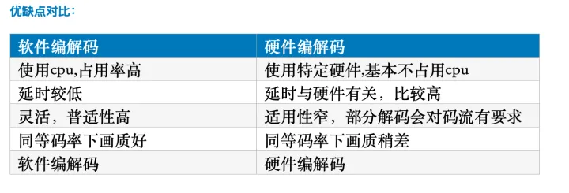

Concept

**9.硬编硬解与软编软解:**

硬编硬解：使用非CPU进行编码解码，通过专用的设备，单独完成视频编码解码，如显卡GPU、专用的DSP、FPGA、ASIC芯片等，曾经的VCD/DVD解压卡、视频压缩卡都被冠以“硬解”的称号；

软编软解：通常指的是视频的[软件](https://link.zhihu.com/?target=https%3A//baike.baidu.com/item/%E8%BD%AF%E4%BB%B6)解码，通过软件解码得到的画面效果通常在电脑配置足够好的情况下，比[硬件解码](https://link.zhihu.com/?target=https%3A//baike.baidu.com/item/%E7%A1%AC%E4%BB%B6%E8%A7%A3%E7%A0%81/3649897)来的好很多；

移动平台上，由于性能及功耗的原因，一般推荐是使用硬编硬解，软件编解码比较消耗cpu。

视频的质量和传输速度之间如何平衡，就涉及到了码率控制。

**10.码率控制:**

码率控制，是一种决定为每一个视频帧**分配多少比特数**的方法，它将决定码率的大小和质量的分配。它涉及**视频质量和信道带宽的折中**，减少码率就会牺牲质量，质量提高就会增加码率。

CBR跟ABR的差异：

（1）当连续的画面变化较小，编码的码率**达不到设定的码率时**，CBR模式会填充数据，直到满足设定的码率，**ABR模式则不会填充。**

（2）当连续的画面变化较大时，**CBR、ABR模式的编码码率，都会有一定程度的上升**，但如果设定的码率不够，画面依然会模糊。