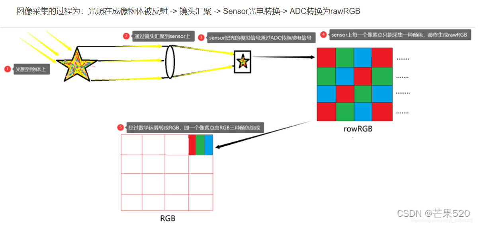

Concept

## 格式

raw rgb yuv

Raw RGB 每个像素只有一种颜色（R、G、B中的一种）；
RGB 每个像素都有三种颜色，每一个的值在0~255之间；
在手机摄像头的测试过程中，由sensor输出的数据就是Raw data（Raw RGB），经过彩色插值就变成RGB

也不一定就是测试过程，想要获得真正的图像，都必须有的一个过程；
sensor输出的数据格式，主要分两种：YUV（比较流行），RGB，这就是sonsor的数据输出；这其中的GRB就是Raw RGB，是sensor的bayer阵列获取的数据（每种传感器获得对应的颜色亮度）；

软件的处理过程当中，为了获得更好的图像质量，还需要白平衡，gamma校正，彩色校正

## VI模块的概念

DEV设备

视频输入设备，支持若干种时序输入，负责对时序进行解析

PIPE管道

视频输入pipe绑定在设备后端，复制设备解析后的数据再处理。（目前暂未实现内容，采用直通方式，同dev相同id设置即可）

VI模块的设计图

## **硬编硬解与软编软解:**

硬编硬解：使用非CPU进行编码解码，通过专用的设备，单独完成视频编码解码，如显卡GPU、专用的DSP、FPGA、ASIC芯片等，曾经的VCD/DVD解压卡、视频压缩卡都被冠以“硬解”的称号；

软编软解：通常指的是视频的[软件](https://link.zhihu.com/?target=https%3A//baike.baidu.com/item/%E8%BD%AF%E4%BB%B6)解码，通过软件解码得到的画面效果通常在电脑配置足够好的情况下，比[硬件解码](https://link.zhihu.com/?target=https%3A//baike.baidu.com/item/%E7%A1%AC%E4%BB%B6%E8%A7%A3%E7%A0%81/3649897)来的好很多；

移动平台上，由于性能及功耗的原因，一般推荐是使用硬编硬解，软件编解码比较消耗cpu。

视频的质量和传输速度之间如何平衡，就涉及到了码率控制。

## **码率控制:**

码率，又称比特率，是指每秒传送的比特(bit)数。单位为 bps(Bit Per Second)，比特率越高，传送数据速度越快。

码率控制，是一种决定为每一个视频帧**分配多少比特数**的方法，它将决定码率的大小和质量的分配。它涉及**视频质量和信道带宽的折中**，减少码率就会牺牲质量，质量提高就会增加码率。

CBR跟ABR的差异：

（1）当连续的画面变化较小，编码的码率**达不到设定的码率时**，CBR模式会填充数据，直到满足设定的码率，**ABR模式则不会填充。**

（2）当连续的画面变化较大时，**CBR、ABR模式的编码码率，都会有一定程度的上升**，但如果设定的码率不够，画面依然会模糊。

正，魔，朝，相

## 帧、行、场

什么是帧？

帧就是早期的电影里面，一幅静态的图像就是一帧,影片里面的画面是每秒24帧，为什么呢，因为人类的眼睛视觉暂留现象刚好是24帧每秒，再多就是浪费

什么是行？

一束电子在水平方向的扫描称为行，或者行扫描

什么是场？

一个行扫描，垂直方向扫描过的区域被称为场，或者场扫描