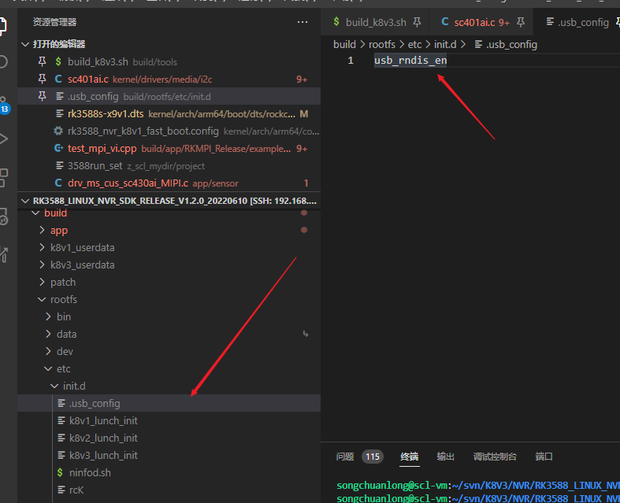
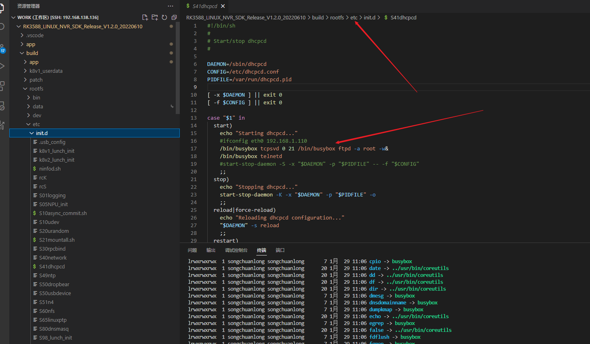
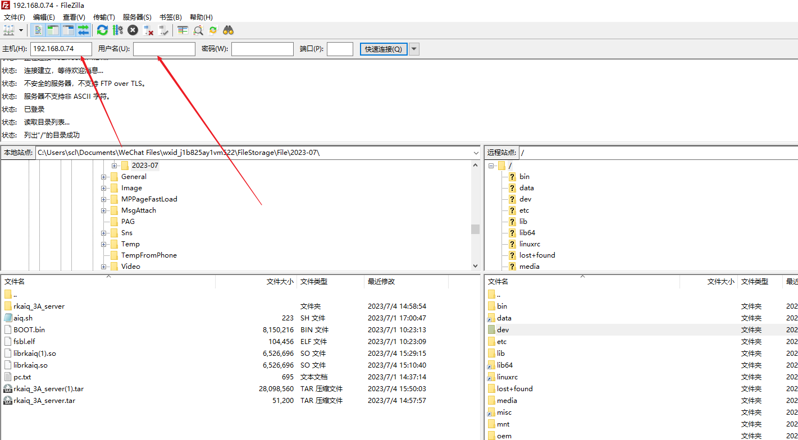

USB

    主机：USB主机（Win/Android/Mac等）
    从机：USB设备（鼠标/键盘/U盘等）

**USB从接入到使用**
    主机发现从机接入后，开始识别从机，成功识别后就可以使用从机的功能了。其中，发现从机接入/拔出的过程称为USB拔插，识别从机的过程称为枚举。

## ADB功能

如果原来是otg要切换成设备模式，上电的时候接入即可识别

&usbdrd_dwc3_0 {

 dr_mode = "peripheral";

 status = "okay";

};

## USB以太网eth功能

1.内核配置

CONFIG_USB_U_ETHER=y
CONFIG_USB_F_ECM=y
CONFIG_USB_F_SUBSET=y
CONFIG_USB_F_RNDIS=y

CONFIG_USB_ETH=y
CONFIG_USB_ETH_RNDIS=y

CONFIG_USB_ETH_EEM is not set

2.修改rootfs下的文件

原来rndis是adb

3.

启动脚本设置

/bin/busybox 要支持这些命令

直接busybox查看

ifconfig usb0 192.168.0.74

电脑打开适配器设置同一网段

确定板子已经在后台跑起来之后

这里连不上就**不要填写用户名**，直接ip连接

## USB控制器和PHY

