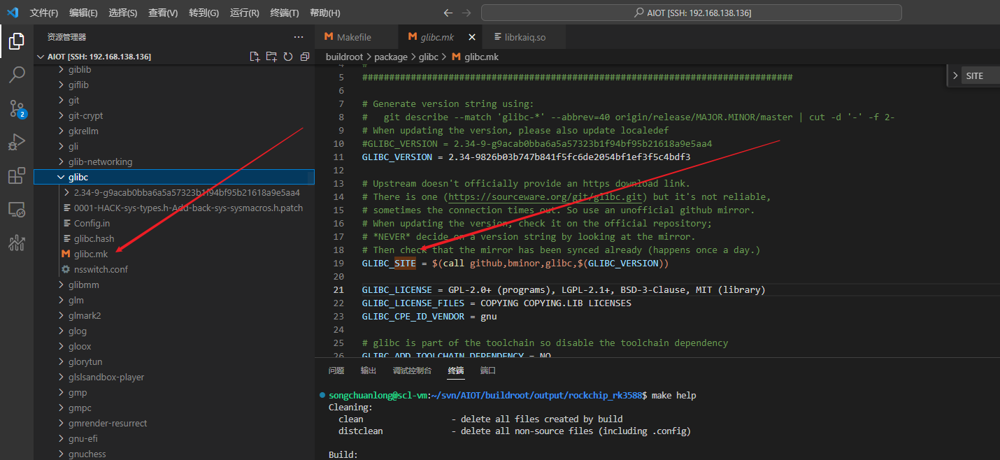

buildroot开启python3功能

##   buildroot默认配置路径

  buildroot/configs/rockchip_rk3588_defconfig

1.make menuconfig

 \> Target packages > Interpreter languages and scripting 下

2.python和python3两个选项

 打开python3后下面会多出python所需的模块选项，按需添加即可

3.将配置好的.config文件的改动更新至buildroot默认配置路径

**如果不想换.config的时候被覆盖，编译的时候询问是否覆盖的时候选N**

## 换源

配置文件中加入

BR2_BACKUP_SITE="http://sources.buildroot.net"
BR2_KERNEL_MIRROR="https://mirror.bjtu.edu.cn/kernel/"
BR2_GNU_MIRROR="http://mirrors.nju.edu.cn/gnu/"
BR2_LUAROCKS_MIRROR="https://luarocks.cn"
BR2_CPAN_MIRROR="http://mirrors.nju.edu.cn/CPAN/"

## 命令行参数

在output下面进入项目

有makefile的目录中make help可看见编译选项

Cleaning:
  clean                  - delete all files created by build
  distclean              - delete all non-source files (including .config)

Build:
  all                    - make world
  toolchain              - build toolchain
  sdk                    - build relocatable SDK
  reinstall              - reinstall all

Configuration:
  menuconfig             - interactive curses-based configurator
  nconfig                - interactive ncurses-based configurator
  xconfig                - interactive Qt-based configurator
  gconfig                - interactive GTK-based configurator
  oldconfig              - resolve any unresolved symbols in .config
  syncconfig             - Same as oldconfig, but quietly, additionally update deps
  olddefconfig           - Same as syncconfig but sets new symbols to their default value
  randconfig             - New config with random answer to all options
  defconfig              - New config with default answer to all options;
                             BR2_DEFCONFIG, if set on the command line, is used as input
  savedefconfig          - Save current config to BR2_DEFCONFIG (minimal config)
  update-defconfig       - Same as savedefconfig
  allyesconfig           - New config where all options are accepted with yes
  allnoconfig            - New config where all options are answered with no
  alldefconfig           - New config where all options are set to default
  randpackageconfig      - New config with random answer to package options
  allyespackageconfig    - New config where pkg options are accepted with yes
  allnopackageconfig     - New config where package options are answered with no

Package-specific:
  <pkg>                  - Build and install <pkg> and all its dependencies
  <pkg>-source           - Only download the source files for <pkg>
  <pkg>-extract          - Extract <pkg> sources
  <pkg>-patch            - Apply patches to <pkg>
  <pkg>-depends          - Build <pkg>'s dependencies
  <pkg>-configure        - Build <pkg> up to the configure step
  <pkg>-build            - Build <pkg> up to the build step
  <pkg>-show-info        - generate info about <pkg>, as a JSON blurb
  <pkg>-show-depends     - List packages on which <pkg> depends
  <pkg>-show-rdepends    - List packages which have <pkg> as a dependency
  <pkg>-show-recursive-depends
                         - Recursively list packages on which <pkg> depends
    <pkg>-show-recursive-rdepends
                                                  - Recursively list packages which have <pkg> as a dependency
      <pkg>-graph-depends    - Generate a graph of <pkg>'s dependencies
      <pkg>-graph-rdepends   - Generate a graph of <pkg>'s reverse dependencies
      <pkg>-dirclean         - Remove <pkg> build directory
      <pkg>-reconfigure      - Restart the build from the configure step
      <pkg>-rebuild          - Restart the build from the build step
      <pkg>-reinstall        - Restart the build from the install step

busybox:
  busybox-menuconfig     - Run busybox menuconfig
  busybox-xconfig        - Run busybox xconfig
  busybox-gconfig        - Run busybox gconfig
  busybox-update-config  - Save the busybox configuration as a full .config file
                             to package/busybox/busybox.config
                             (or override with BUSYBOX_KCONFIG_FILE)

Documentation:
  manual                 - build manual in all formats
  manual-html            - build manual in HTML
  manual-split-html      - build manual in split HTML
  manual-pdf             - build manual in PDF
  manual-text            - build manual in text
  manual-epub            - build manual in ePub
  graph-build            - generate graphs of the build times
  graph-depends          - generate graph of the dependency tree
  graph-size             - generate stats of the filesystem size
  list-defconfigs        - list all defconfigs (pre-configured minimal systems)

Miscellaneous:
  source                 - download all sources needed for offline-build
  external-deps          - list external packages used
  legal-info             - generate info about license compliance
  show-info              - generate info about packages, as a JSON blurb
  pkg-stats              - generate info about packages as JSON and HTML
  missing-cpe            - generate XML snippets for missing CPE identifiers
  printvars              - dump internal variables selected with VARS=...

  make V=0|1             - 0 => quiet build (default), 1 => verbose build
  make O=dir             - Locate all output files in "dir", including .config

## buildroot/package

如果要修改为本地下载，还需要**DEMO_NAME_SITE_METHOD = local**

注意严格要求不能多任何的空格等，否则不会生效

## .mk文件的写法

_VERSION结尾的变量是源码的版本
_SITE结尾变量是源码的下载地址
_SITE_METHOD结尾的变量是源码下载方法
_BUILD_CMDS结尾的变量会在buildroot框架编译的时候执行，用于给源码的Makefile传递编译选项和链接选项，调用源码的Makefile。
_INSTALL_TARGET_CMDS结尾的变量是在编译完之后，自动安装执行，一般是让buildroot把编译出来的的bin或lib拷贝到指定目录。
$(eval $(generic-package))最核心的就是这个，一定不能漏掉，不然源码不会被编译，该函数就是把整个.mk构建脚本，通过Buildroot框架的方式，展开到buildroot/目录下的Makfile中，生成的构建目标。
https://blog.csdn.net/weixin_42913061/article/details/122976798
