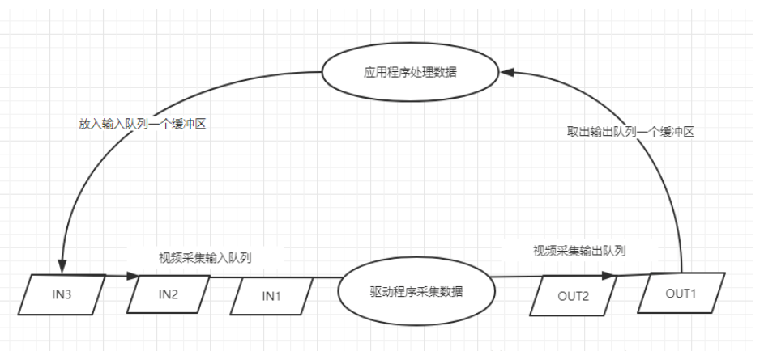

## V4L2驱动

搞清楚流程VIN部分

### 流程图

具体流程如下：

[Linux应用开发【第七章】摄像头V4L2编程应用开发 - 知乎 (zhihu.com)](https://zhuanlan.zhihu.com/p/443727970#:~:text=V4L2的代码主要位于video2lcd%2Fvideo%2Fv4l2.c文件中，接下来就针对上文,V4L2程序实现流程和流程中使用的重要数据结构，结合v4l2.c文件中的代码进行说明。)

### 视频采集

一共有三种视频采集方式： 使用read、write方式、内存映射方式和用户指针模式。

read、write方式：在用户空间和内核空间不断拷贝数据，占用了大量用户内存空间，效率不高。

内存映射方式：把设备里的内存映射到应用程序中的内存控件，直接处理设备内存，这是一种有效的方式。mmap函数就是使用这种方式。

用户指针模式：内存片段由应用程序自己分配。这点需要在v4l2_requestbuffers里将memory字段设置成V4L2_MEMORY_USERPTR。

里面有usb uvc 的V4L2接口

[Rockchip_Trouble_Shooting_Linux4.19_USB_Gadget_UVC_CN.pdf](file:///D:/书籍/阅读/RK3588AIOTdocs/Common/USB/Rockchip_Trouble_Shooting_Linux4.19_USB_Gadget_UVC_CN.pdf)

## UVC和V4L2的关系

- UVC是一种usb视频设备驱动。用来支持usb视频设备，凡是usb接口的摄像头都能够支持，C是类的意思
- V4L2是Linux下的视频采集框架。用来统一接口，向应用层提供API

**两者之间的关系**

简单的讲V4L2就是用来管理UVC设备的并且能够提供视频相关的一些**应用程序接口**。那么这些API怎么使用或者能被谁使用呢。在Linux系统上有很多的开源软件能够支持V4L2。常见的有FFmpeg、opencv、Skype、Mplayer等等。

**这样一个UVC能够进行视频显示的话应该满足三个条件：**

　　1、 UVC的camera硬件支持

　　2 、UVC驱动支持，包括USB设备驱动以及v4l2的支持

　　3、 上层的应用程序支持

linux UVC驱动是为了全面的支持UVC设备。它包括V4L2内核驱动程序和用户空间工具补丁。这个视频设备或者USB视频类的USB设备类的定义定义了在USB上的视频流的功能。UVC类型的外设只需要一个通用的驱动支持就能够正常工作，就像USB 大容量存储设备一样。

UVC的linux  kernel驱动程序和支持的硬件设备都在这里有相关的描述：http://www.ideasonboard.org/uvc/。

难道是上层的如FFMPEG调用V4L2再调用UVC

## 数据结构定义

kernel/include/media/videobuf2-core.h	struct vb2_buffer 缓冲区，里面有属性是queue

## **参考链接**

[V4L2框架解析|极客笔记 (deepinout.com)](https://deepinout.com/v4l2-tutorials/linux-v4l2-architecture.html#ftoc-heading-2)

[(126条消息) Linux - 使用V4L2（总结）_linux v4l2_喜闻樂见的博客-CSDN博客](https://blog.csdn.net/weixin_43707799/article/details/107821189)

网络摄像头

[V4l2视频输出实现流程 - 知乎 (zhihu.com)](https://zhuanlan.zhihu.com/p/438383715)

camera

[2. Camera 使用 — Firefly Wiki (t-firefly.com)](https://wiki.t-firefly.com/zh_CN/ROC-RK3568-PC/driver_camera.html#linux-xi-tong-yu-lan-she-xiang-tou)