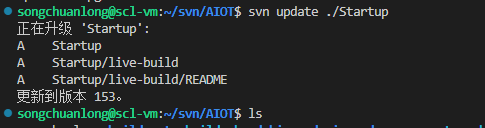

 

### checkout

svn 检出

在一个目录下

svn checkout https://192.168.10.3:8443/svn/CVision/branches/K8V3

### add

svn add 目录

### commit

svn ci -m "" 路径

chmod

-R 递归

chmod -R 777 /home/linux

svn add 文件夹/文件名

svn commit -m "" 路径(文件夹/文件名)

### update

注意可直接进入一个目录下面直接update 回更新该目录

如何从服务器拉取一个新的目录

svn update 相对路径

svn update

当前文件夹是空的，服务器上，文件下下面的两个文件下有东西，直接进入该目录 update即可，不需要其他参数选项

### svn status

-q 查看更精确的本地目录下的文件
