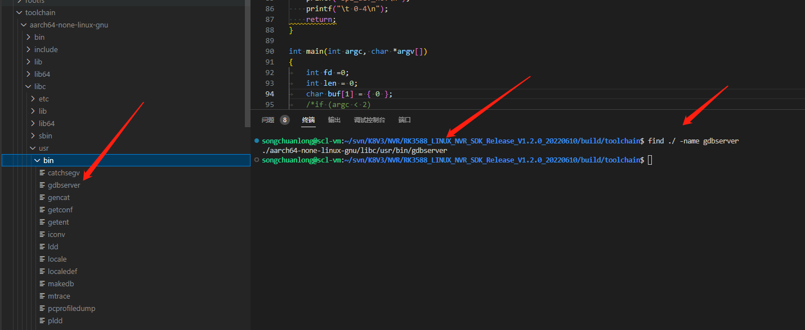
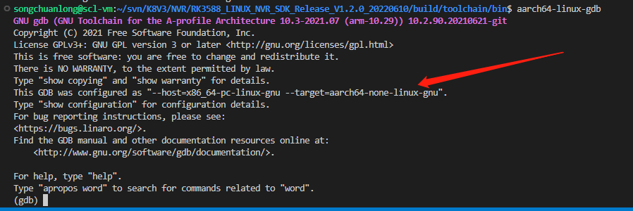

gdb

## gdbserver

### 前言

https://www.cnblogs.com/pied/p/6526969.html

嵌入式系统的gdb环境搭建

https://blog.csdn.net/qq_35031421/article/details/108557903

注意放到嵌入式系统需要调试程序，在编译时必须加上“-g” 选项，这样编译出来的可执行文件才带有调试信息

需要说明的是，在调试过程中，gdbserver 侧是不接受 ctrl-c 来终止程序的。退出 gdbserver 目前知道的就两种方法，在 gdb 侧执行 quit，或者在 remote 侧使用 killall。

### 正文

**一、准备好gdb 和gdb server**

**一般这两个东西在交叉编译里面都能找到，找到了直接把gdbserver放到板子上，gdb配置到本机的环境变量里面**

**二、把目标代码放到开发板上，但是注意源代码在本机，所以在本机的编译目录下面运行GDB，，才不会报找不到程序的错误。**

https://blog.csdn.net/m0_37845735/article/details/107031218

rk3588里面已经放入了gdb，以后configure 可以参考下面的--host和--target

### 命令

注意可执行文件要放在开发板一个，本地一个

本地gdb执行的时候，最好在程序可执行文件所在的目录执行

**远端**

gdbserver 192.168.0.75:2000 程序名    //IP是主机端的IP ，这个端口号随便选一个，不冲突就行

远程连接没有run命令，直接run

**主机端**

aarch64-rockchip1031-linux-gnu-gdb 程序名

进入gdb后

target remote 192.168.0.74:2000

**连接成功**

b main

n next //不会进入函数

s step //会进入函数

list 直接l会显示不全

可以先set listsize 50

这样就从第一行开始显示了

**在程序编译时增加-g选项以支持gdb调试**

如：

$ gcc -g example.c -o example.x

通过上述命令对example.c编译之后，使用下列命令进入到gdb调试：

$ gdb example.x

在gdb调试中，常用的命令有以下几个：

$ list 缩略为 l

列出程序源码，每次列出10行，按回车重复运行上一命令；

$ run 缩略为 r

程序开始运行，在r后可以加入程序启动参数，程序运行到断点处暂停；

$ continue 缩略为 c

程序继续运行，到下一断点处暂停；

单步调试

$ step 缩略为s

$ next 缩略为 n

程序继续运行到下一断点；

$ break 缩略为 b

在程序某一位置设置断点；

$ info break 缩略为 i b

查看断点信息；

设置/查看运行参数

$ set args ---/show args

加载运行中的进程进行调试(Attach to the running process to be debugged.)：

$ gdb attatch pid

Specifying source directories

$ dir dirname …

以十六进制输出内存块数据

$ x/28hx ---

段错误调试，core文件样例

通过ulimit命令查看一下系统是否配置支持了dump core的功能。通过ulimit -c或ulimit -a，可以查看core file大小的配置情况，如果为0，则表示系统关闭了dump core；可以通过ulimit -c unlimited来打开。若发生了段错误，但没有core dump，是由于系统禁止core文件的生成。

**$ gdb [exec file] [core file]**

查看堆栈信息：

$ bt

PS：对于python程序在linux下可以使用pdb做调试！

Published by Windows Livewriter.

**调试开始时，必须先载入要进行调试的程序，可以用以下两种方式：**

\* 在启动gdb后执行以下命令：

file 可执行文件路径

\* 在gdb启动时就载入程序：

gdb 可执行文件路径

载入程序后，接下来就是要进行断点的设置，要监视的变量的添加等工作，下面对在这个过程中常会用到的命令逐一进行介绍：

\* list ：显示程序中的代码，常用使用格式有：

list

输出从上次调用list命令开始往后的10行程序代码。

list -

输出从上次调用list命令开始往前的10行程序代码。

list n

输出第n行附近的10行程序代码。

list function

输出函数function前后的10行程序代码。

\* forward/search ：从当前行向后查找匹配某个字符串的程序行。使用格式：

**forward/search 字符串**

查找到的行号将保存在$_变量中，可以用print $_命令来查看。

\* reverse-search ：和forward/search相反，向前查找字符串。使用格式同上。

\* break ：在程序中设置断点，当程序运行到指定行上时，会暂停执行。使用格式：

break 要设置断点的行号

\* tbreak ：设置临时断点，在设置之后只起作用一次。使用格式：

tbreak 要设置临时断点的行号

\* clear ：和break相反，clear用于清除断点。使用格式：

clear 要清除的断点所在的行号

\* run ：启动程序，在run后面带上参数可以传递给正在调试的程序。

\* awatch ：用来增加一个观察点(add watch)，使用格式：

awatch 变量或表达式

当表达式的值发生改变或表达式的值被读取时，程序就会停止运行。

\* watch ：与awatch类似用来设置观察点，但程序只有当表达式的值发生改变时才会停止运行。使用格 式：

watch 变量或表达式

需要注意的是，awatch和watch都必须在程序运行的过程中设置观察点，即可运行run之后才能设置。

*** commands ：设置在遇到断点后执行特定的指令。**使用格式有：

commands

设置遇到最后一个遇到的断点时要执行的命令

commands n

设置遇到断点号n时要执行的命令

注意，commands后面跟的是断点号，而不是断点所在的行号。

在输入命令后，就可以输入遇到断点后要执行的命令，每行一条命令，在输入最后一条命令后输入end就可以结束输入。

\* delete ：清除断点或自动显示的表达式。使用格式：

delete 断点号

\* disable ：让指定断点失效。使用格式：

disable 断点号列表

断点号之间用空格间隔开。

\* enable ：和disable相反，恢复失效的断点。使用格式：

enable 断点编号列表

\* ignore ：忽略断点。使用格式：

ignore 断点号 忽略次数

\* condition ：设置断点在一定条件下才能生效。使用格式：

condition 断点号 条件表达式

\* cont/continue ：使程序在暂停在断点之后继续运行。使用格式：

cont

跳过当前断点继续运行。

cont n

跳过n次断点，继续运行。

当n为1时，cont 1即为cont。

\* jump ：让程序跳到指定行开始调试。使用格式：

jump 行号

*** next ：继续执行语句，但是跳过子程序的调用**。使用格式：

next

执行一条语句

next n

执行n条语句

\* nexti ：单步执行语句，但和next不同的是，它会跟踪到子程序的内部，但不打印出子程序内部的语句。使用格式同上。

\* step ：与next类似，但是它会跟踪到子程序的内部，而且会显示子程序内部的执行情况。使用格式同上。

\* stepi ：与step类似，但是比step更详细，是nexti和step的结合。使用格式同上。

\* whatis ：显示某个变量或表达式的数据类型。使用格式：

whatis 变量或表达式

\* ptype ：和whatis类似，用于显示数据类型，但是它还可以显示typedef定义的类型等。使用格式：

ptype 变量或表达式

\* set ：设置程序中变量的值。使用格式：

set 变量=表达式

set 变量:=表达式

\* display ：增加要显示值的表达式。使用格式：

display 表达式

\* info display ：显示当前所有的要显示值的表达式。

\* delete display/undisplay ：删除要显示值的表达式。使用格式：

delete display/undisplay 表达式编号

\* disable display ：暂时不显示一个要表达式的值。使用格式：

disable display 表达式编号

\* enable display ：与disable display相反，使用表达式恢复显示。使用格式：

enable display 表达式编号

*** print ：打印变量或表达式的值。**使用格式：

print 变量或表达式

表达式中有两个符号有特殊含义：$和$$。

$表示给定序号的前一个序号，$$表示给定序号的前两个序号。

如果$和$$后面不带数字，则给定序号为当前序号。

\* backtrace ：打印指定个数的栈帧(stack frame)。使用格式：

backtrace 栈帧个数

\* frame ：打印栈帧。使用格式：

frame 栈帧号

\* info frame ：显示当前栈帧的详细信息。

\* select-frame ：选择栈帧，选择后可以用info frame来显示栈帧信息。使用格式：

select-frame 栈帧号

\* kill ：结束当前程序的调试。

\* quit ：退出gdb。 

如要查看所有的gdb命令，可以在gdb下键入两次Tab(制表符)，运行“help command”可以查看命令command的详细使用格式。

### 

## core文件

gdb ./可执行文件 ./core文件

如果gdb是交叉编译，gdb也要使用交叉编译版本

进入后

info threads 

bt 调用栈

一、Linux生成core文件
当进程异常时如段错误退出时会产生core文件，当进程执行某处代码阻塞时，可以强制生成core文件。

1.1 core文件生成大小限制
ulimit -c，可查看生成core文件的大小，0表示未开启，unlimited表示无限制。
ulimit -c filesize，限制生成core文件的大小，ulimit -c 0表示不开启，ulimit -c 1000表示限制core文件限制为1000KB，ulimit -c unlimited无限制。
1.2 core文件生成路径
默认路径为当前命令的执行路径，以下命令可查看：
cat /proc/sys/kernel/core_pattern
/sbin/sysctl kernel.core_pattern

临时修改：修改/proc/sys/kernel/core_pattern文件，echo "/corefile/core" > /proc/sys/kernel/core_pattern可以将core文件统一生成到/corefile目录下。
永久修改：使用sysctl -w name=value命令，/sbin/sysctl -w kernel.core_pattern=/corefile/core。
有的机器或docker使用/corefile/core或默认路径无法保存core文件（可能是权限问题？），这时候可以使用系统中已经存在的目录作为core文件生成路径，如/tmp/core。
1.3 core文件生成文件名
默认文件名为core，以下命令可查看：
cat /proc/sys/kernel/core_pattern
/sbin/sysctl kernel.core_pattern
临时修改：修改/proc/sys/kernel/core_pattern文件，echo "core-%p-%e" > /proc/sys/kernel/core_pattern生成core文件名为core-pid-程序文件名
永久修改：使用sysctl -w name=value命令，/sbin/sysctl -w kernel.core_pattern=core-%p-%e
%p - insert pid into filename 添加pid
%u - insert current uid into filename 添加当前uid 
%g - insert current gid into filename 添加当前gid
%s - insert signal that caused the coredump into the filename 添加导致产生core的信号 
%t - insert UNIX time that the coredump occurred into filename 添加core文件生成时的unix时间(由1970年1月1日计起的秒数)
%h - insert hostname where the coredump happened into filename 添加主机名
%e - insert coredumping executable name into filename 添加命令名（程序文件名）

1.4 程序崩溃没有core文件
可能是当前执行的命令没有权限改动core_pattern下指定的目录：

$ cat /proc/sys/kernel/core_pattern
core-%e-%p-%t
#或
/corefile/core-%e-%p-%t
可以试试修改core_pattern目录为：

echo "/tmp/core-%e-%p-%t" > /proc/sys/kernel/core_pattern
————————————————
原文链接：https://blog.csdn.net/qq_42570601/article/details/114842320