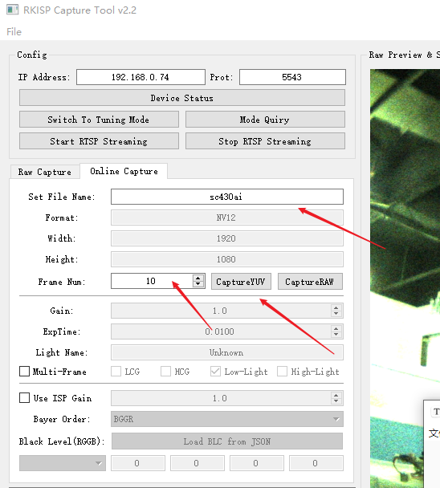
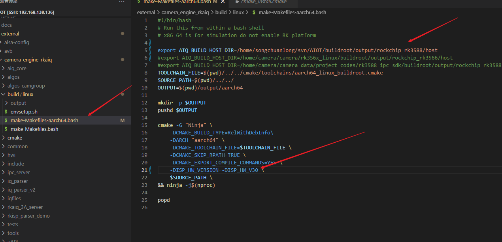

## aiq、tool-server、tuner

aiq 需要自己编译

tool-server 链接tuner和aiq

tuner x86上使用 

## VI结构

## tool运行参数

-s  /dev/video8

​	

-i 指定iq文件的读取路径

## 在线抓取YUV图

板端，需要设置 -s /dev/video8

下图中可设置

文件名

抓取的帧数

抓取YUV

选择看见的帧

第一帧都是比较模糊的

## rkaiq_3A_server(aiq)

### 开启rkaiq的log

> 由 [韦 敦（福州）](https://redmine.rock-chips.com/users/3021) 更新于 [大约一小时](https://redmine.rock-chips.com/projects/fae/activity?from=2023-07-05) 之前
>
> 建议贴一下运行rkaiq_3A_sever 的log看看。
> 可以将aiq 的log先打开，再跑，log会多一些
>
> 先打开一个终端
> export persist_camera_engine_log=0x1ff1
> 然后跑rkaiq_3A_server

## iqfiles

以下基于NVR V1.6 中的aiq

rk3588 支持 RKISP30

iq文件放置于/etc

json文件命名

sc430ai_sc430ai_IR.json

## 编译rkaiq

**NVR目录下面有这个文件叫rkaiq_3A_server**

camera_engine_rkaiq 

cd /build/linux

./envsetup 30 //rk3588是isp3.0

//修改下面这个环境变量的路径

export AIQ_BUILD_HOST_DIR=/home/songchuanlong/svn/AIOT/buildroot/output/rockchip_rk3588/host

编译buildroot

./make-Makefiles-aarch64.bash

下面这个版本可直接修改

## cmakelists.txt

这里对生成库的链接选项的修改，但是还没加上ld的修改

可执行程序这里我们已经加上了动态链接器的修改，相关工具还有patchelf [高版本gcc编译出的程序在低版本glibc机器上运行 - 简书 (jianshu.com)](https://www.jianshu.com/p/77d7f7dc93b3)

## readelf

应该用交叉编译的readelf

