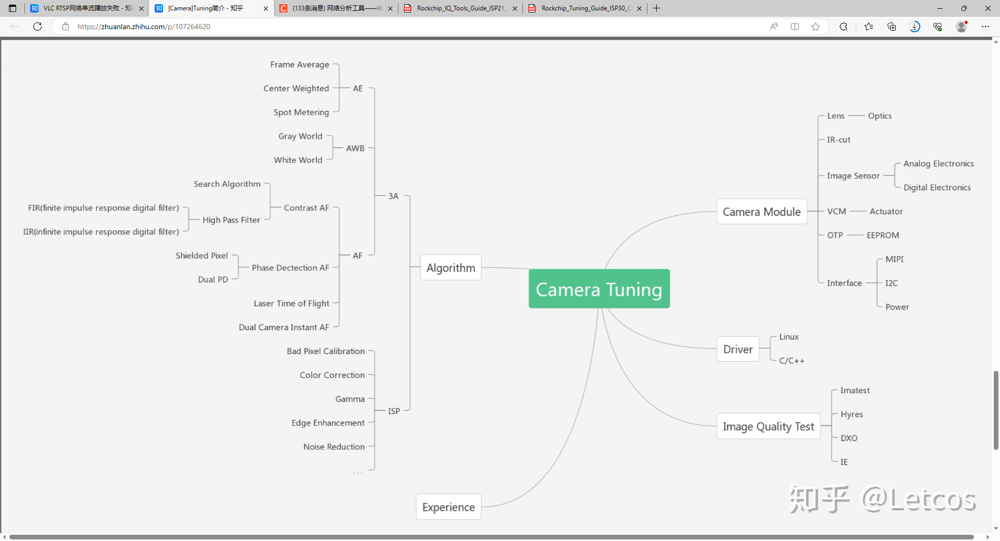
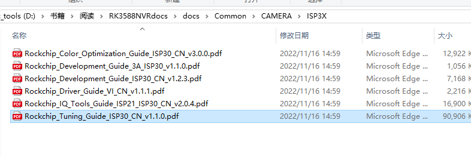
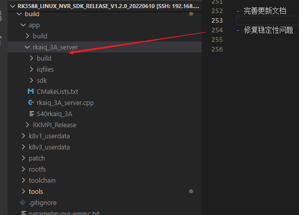
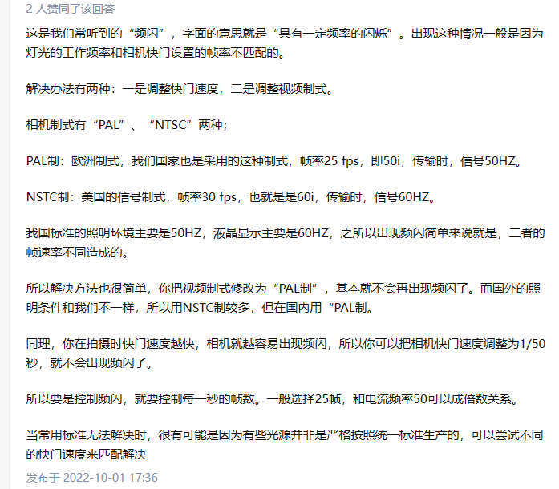

## Tuning

[[Camera\]Tuning简介 - 知乎 (zhihu.com)](https://zhuanlan.zhihu.com/p/107264620)

[(136条消息) RK3588s imx415相机适配及ISP调优系列（三）--- RKISP调试环境配置_光脚怕穿鞋的博客-CSDN博客](https://blog.csdn.net/zongheng_raobo/article/details/130709091?spm=1001.2014.3001.5502)

频闪

流程 真正的  VI -----------> ISP IQ tuning --------------> 代码的 vi

## 安装

安装时找不到相关的dll文件

在环境变量中添加所在目录

## AEC/AGC

与亮度有关的AEC是调节曝光时间 AGC是调节增益

优先关闭增益进行排查

AGC部分先排除数字gain，在调节模拟gain

DIG GAIN（数字增益）和DIG FINE GAIN（数字精细增益）是在数字图像处理中使用的两种增益调节参数。

1. DIG GAIN（数字增益）：它是一种对整个图像进行放大的操作，可以增加整体图像的亮度。数字增益通过放大每个像素的数值来提高图像的亮度水平。然而，使用过高的数字增益可能会引入噪点和失真，并降低图像的质量。
2. DIG FINE GAIN（数字精细增益）：它是一种对图像进行局部放大的操作，可以增强特定区域的细节。数字精细增益通常用于增强图像的对比度和细节，并在保持整体曝光适当的情况下，突出显示感兴趣的部分。

这两种增益参数通常用于图像处理算法中，如自动曝光、白平衡、对比度增强等。它们可以通过调整相应的参数值来控制图像的明暗度和对比度。然而，在使用过高的增益时要谨慎，以免引入图像噪点和失真。

## 曝光的原理

是以行为单位，下面的积分时间是技术说法，就是曝光时间，指的是从reset到读出的这段时间

曝光与模糊拖影

其他曝光问题，果冻效应，卷帘曝光，扭曲，形变

与之相对的是全局曝光，全部像点都同时接收

1. **在自动曝光模式下可调整 EV、白平衡**
2. **在手动曝光模式下可调整 ISO、Shutter**
3. **在各镜头独立曝光模式下可调整 EV、白平衡**
4. **可重置曝光参数为默认设置**

## IQ文件

## 概念isp 3a

**sensor**是图像传感器

**isp**是图像处理器

**3A**自动曝光AE/[自动白平衡](https://www.zhihu.com/search?q=自动白平衡&search_source=Entity&hybrid_search_source=Entity&hybrid_search_extra={"sourceType"%3A"answer"%2C"sourceId"%3A2701206105})AWB/自动对焦AF

**AIQ** 自动图像质量

图像处理器ISP会对从图像传感器中输出的RAW图进行处理，如黑电平校正，颜色插值，噪声过滤等，之后ISP会输出统计信息给3A模块。3A模块会对镜头和传感器进行调解。

CIS（CMOS image sensor）

