芯片名称 SC430AI

## 驱动

设备树

[(130条消息) camera调试：RK3588 MIPI/DVP camera关键配置_人生苦短，我想躺平的博客-CSDN博客](https://blog.csdn.net/qq_34341546/article/details/128907000?spm=1001.2101.3001.6650.17&utm_medium=distribute.pc_relevant.none-task-blog-2~default~BlogCommendFromBaidu~Rate-17-128907000-blog-88417492.235^v38^pc_relevant_anti_t3_base&depth_1-utm_source=distribute.pc_relevant.none-task-blog-2~default~BlogCommendFromBaidu~Rate-17-128907000-blog-88417492.235^v38^pc_relevant_anti_t3_base&utm_relevant_index=25)

[(130条消息) camera调试：RK3588如何点亮一个sensor？_raw sensor_人生苦短，我想躺平的博客-CSDN博客](https://blog.csdn.net/qq_34341546/article/details/128875553)

sensor

[(130条消息) camera调试：i2c不通如何排查？_camera i2c_人生苦短，我想躺平的博客-CSDN博客](https://blog.csdn.net/qq_34341546/article/details/129030535)

专栏

[(130条消息) camera调试_人生苦短，我想躺平的博客-CSDN博客](https://blog.csdn.net/qq_34341546/category_12188874.html)

## camera

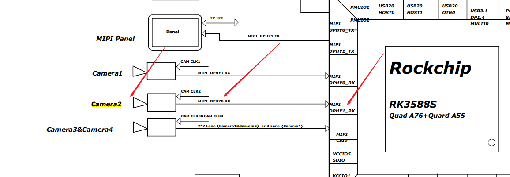

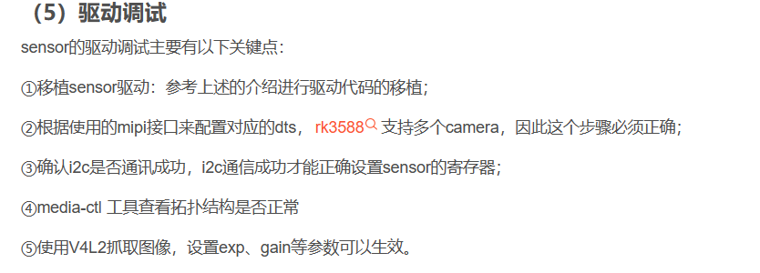

## 翻译

线性输出（Linear Output）和高动态范围（HDR，High Dynamic Range）是两种不同的图像处理技术，分别应用于不同的场景。

线性输出是指图像传感器将光信号转换为电信号输出时，输出电压与光信号之间的关系呈现线性。即，输入和输出之间成正比关系，且不会产生非线性失真或者任何非线性特性。这种技术在相机和图像处理系统中应用广泛，能够提供更高的动态范围和更准确的图像重建，使得硬件和软件算法可以更好地进行图像处理和优化。

而 HDR 技术则是一种能够提供更广泛动态范围的图像处理技术。HDR 技术可以通过在同一场景下拍摄多张照片，以不同曝光时间捕捉多个不同亮度层次的细节信息，再通过算法合成一张高动态范围图像，使得在同一张图像中可以展示出更宽广的亮度范围和更多的细节。

简单来说，线性输出通常用于保证图像清晰度、色彩准确性等方面的要求；而 HDR 技术则用于展现更宽广、更有层次的画面，适用于那些需要表现明暗细节丰富的场景，如夜景、高对比度场景等。

需要注意的是，线性输出和 HDR 不是彼此排斥的概念，两者可以相互结合，以达到更好的图像质量。例如，一些高端相机和手机会在 HDR 技术的基础上结合线性输出技术，以提供更高质量的图像输出。

## i2c

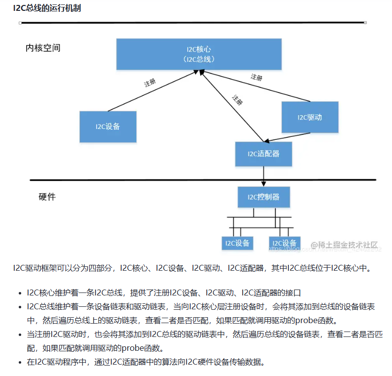

## 命令

i2c开头的有很多命令

rk3588s-evb4-lp4x.dtsi这里面有很多i2c挂载的驱动可以参考，有sensor关键词

驱动，管脚，内核配置

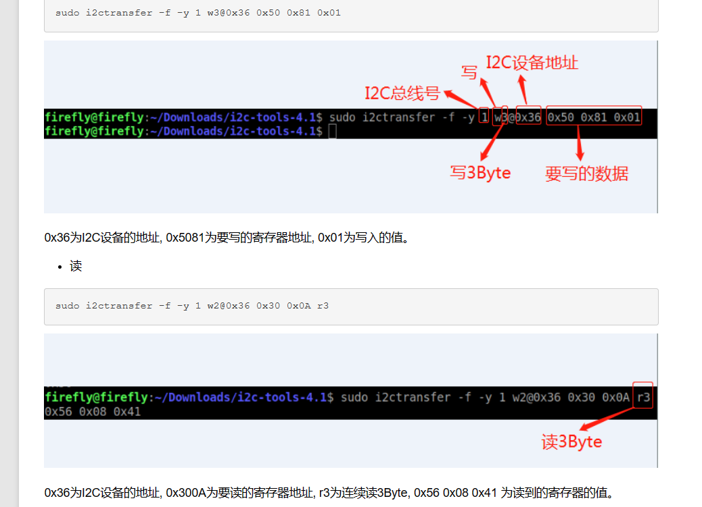

## 接口

### i2c

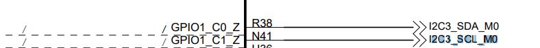

### mipi接口

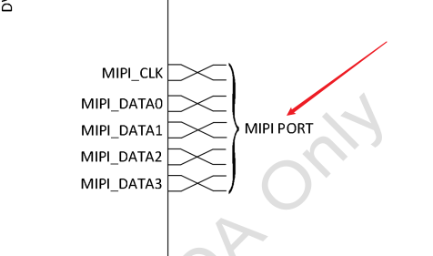

设备地址

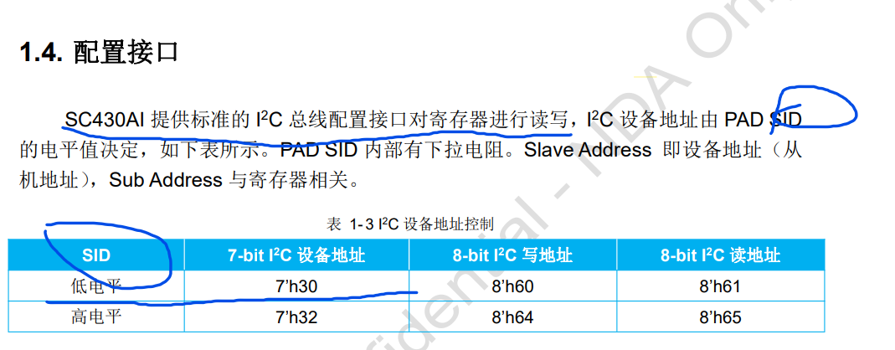

推荐 传输速率不大于1Gbps

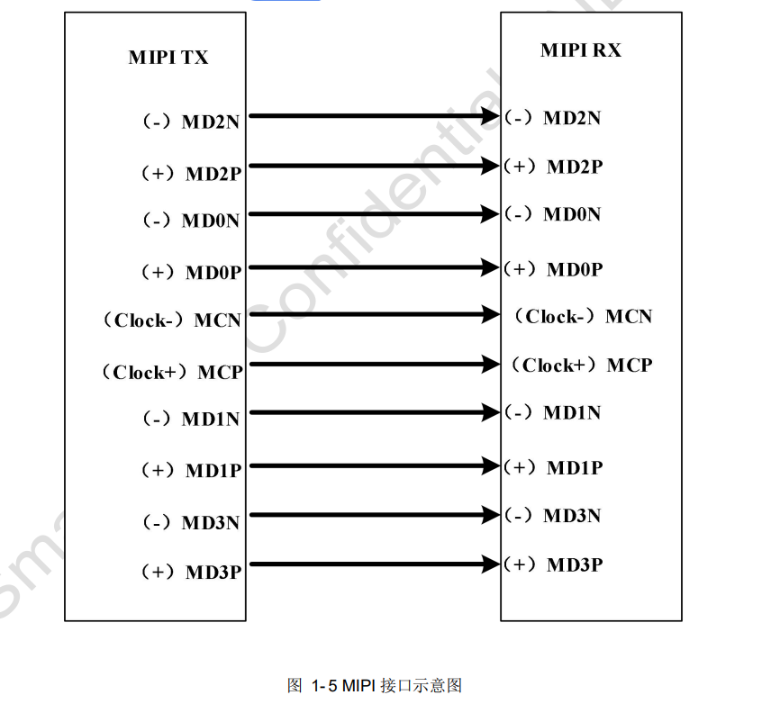

## uart

串口设备树只要打开状态，加上配置正确的管脚

差错步骤

确认发送的TX正确，避免两端都是TX

直接CAT串口可能看不到数据

stty 115200

stty raw之后看到的也是乱码

所以直接使用程序最好

这个代表M0这组管脚，详细的GPIO口不用比对了

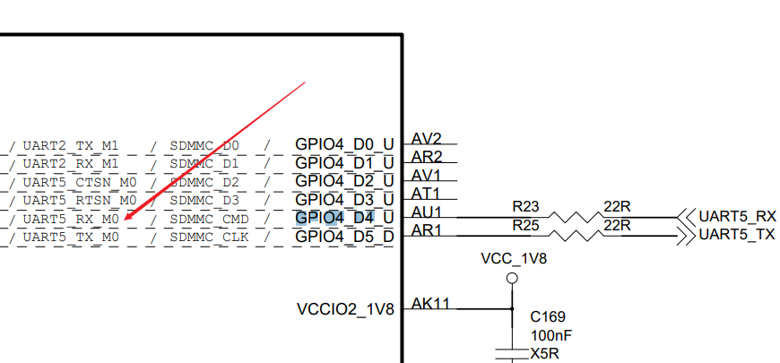

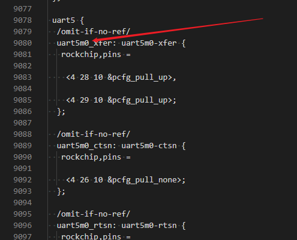

## dts配置引脚状态

&pinctrl {

  camera {

​    cam_pwdn_gpio: cam-pwdn-gpio {

​      rockchip,pins = <1 RK_PB0 RK_FUNC_GPIO &pcfg_pull_up>;

​    };

  };

};

这段代码是在设备树（Device Tree）中描述摄像头电源控制引脚的 GPIO 控制器（GPIO controller）及其属性。具体来说，它定义了一个名为 “cam_pwdn_gpio” 的 GPIO 控制器节点，并指定了该节点所使用的 GPIO 引脚编号、寄存器控制模式及引脚上拉配置模式。其中，“&pinctrl” 是一个引用（reference），用于引用该设备的引脚控制器节点。

具体来说，该代码中：

- "camera" 是一个子节点名称，表示这个子节点描述了摄像头相关的属性。
- "cam-pwdn-gpio" 是一个子节点的子节点，代表了摄像头电源控制引脚的 GPIO 控制器节点名称。
- "rockchip,pins" 属性指定了该 GPIO 控制器所使用的引脚编号、寄存器控制模式及引脚上拉配置模式，其意义如下：
  - "1" 是该 GPIO 控制器使用的物理引脚编号，这里指定了 RK3399 SoC 上 PB0 引脚作为控制摄像头电源的引脚。
  - "RK_FUNC_GPIO" 指定该引脚的功能为 GPIO。
  - "&pcfg_pull_up" 则表示启用了内部上拉功能，使得引脚在空载状态下保持高电平，以防止意外地使摄像头开启。

需要注意的是，在实际的系统中，不同的 SoC 和芯片厂商可能会采用不同的设备树结构和属性名称，所以在定制设备树时需要根据具体情况进行相应的调整和修改。

init controls

struct sc401ai_mode

  {

​    .width = 2688,

​    .height = 1520,

​    .max_fps = {

​      .numerator = 10000,

​      .denominator = 300000,

​    },

​    .exp_def = 0x0080,

​    .hts_def = 0x0578 * 2,

​    .vts_def = 0x05dc,

​    .bus_fmt = MEDIA_BUS_FMT_SBGGR10_1X10,

​    .reg_list = sc401ai_linear_10_2560x1440_4lane_regs,

​    .hdr_mode = NO_HDR,

​    .mipi_freq_idx = 0,

​    .vc[PAD0] = V4L2_MBUS_CSI2_CHANNEL_0,

  },

struct v4l2_ctrl_handler *handler;

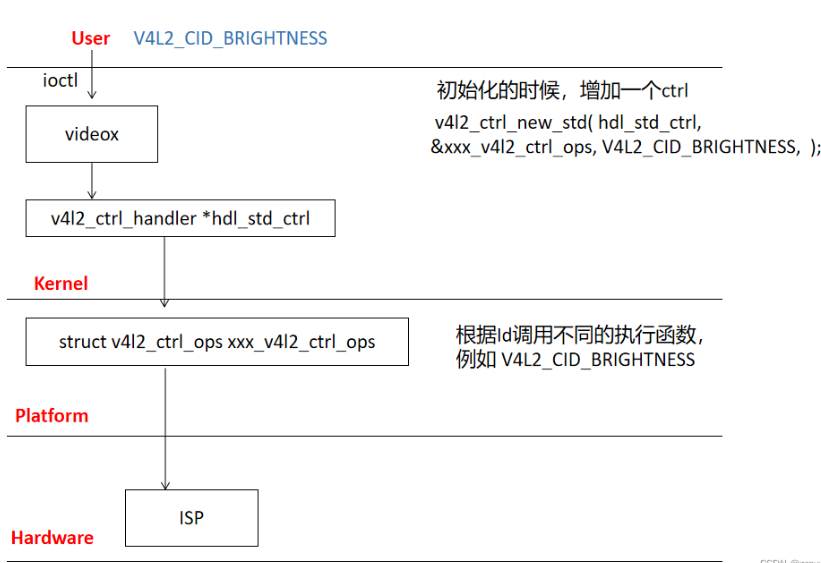

这段代码是用于对 V4L2 控制器的参数进行基本的合法性检查。它会检查 `id`、`name`、`elem_size`、`type` 等参数是否合法。具体来说：

- `id` 必须大于0，且小于 V4L2_CID_PRIVATE_BASE；
- `name` 不能为 NULL；
- `elem_size` 必须大于0；
- 如果 `type` 是 `V4L2_CTRL_TYPE_MENU`，则 `qmenu` 不能为空指针；
- 如果 `type` 是 `V4L2_CTRL_TYPE_INTEGER_MENU`，则 `qmenu_int` 不能为空指针。

如果有任何一个条件不满足，则会调用 `handler_set_err` 函数设置错误码为 `-ERANGE` 并返回 NULL，表示创建控制器失败。

本章主要介绍v4l utils中的两个命令行工具：media-ctl和v4l2-ctl

 media-ctl，用于查看和配置拓扑

 v4l2-ctl，用于配置v4l2控件、捕获帧、设置cif、isp和sensor

## V4L2

[(132条消息) Camera | 4.瑞芯微平台MIPI摄像头应用程序编写_一口Linux的博客-CSDN博客](https://blog.csdn.net/daocaokafei/article/details/127894821?spm=1001.2101.3001.6650.3&utm_medium=distribute.pc_relevant.none-task-blog-2~default~CTRLIST~Rate-3-127894821-blog-128045530.235^v38^pc_relevant_anti_t3_base&depth_1-utm_source=distribute.pc_relevant.none-task-blog-2~default~CTRLIST~Rate-3-127894821-blog-128045530.235^v38^pc_relevant_anti_t3_base&utm_relevant_index=4)

https://gitee.com/yikoulinux/v4l2-app

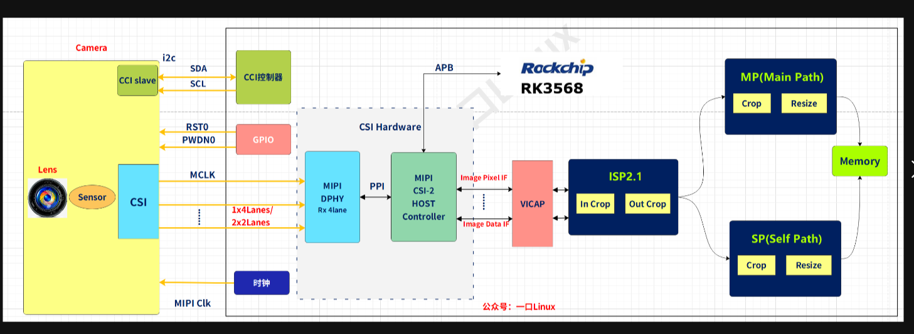

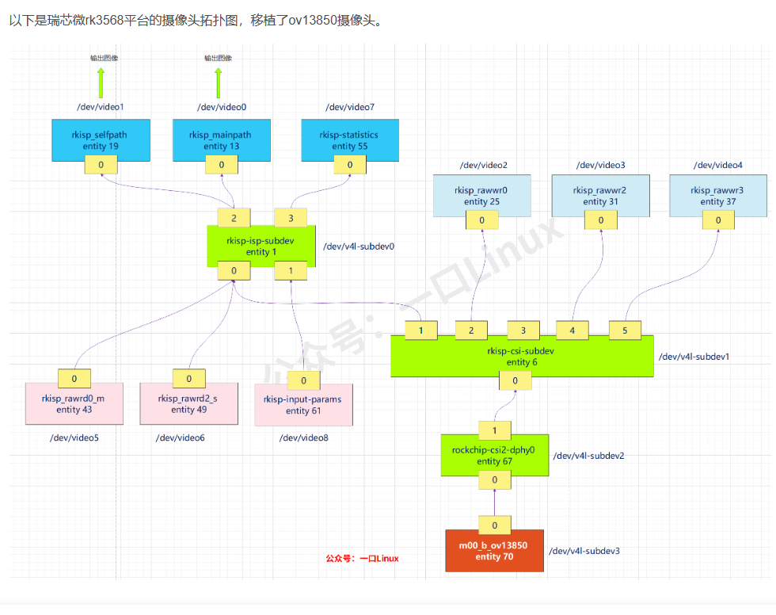

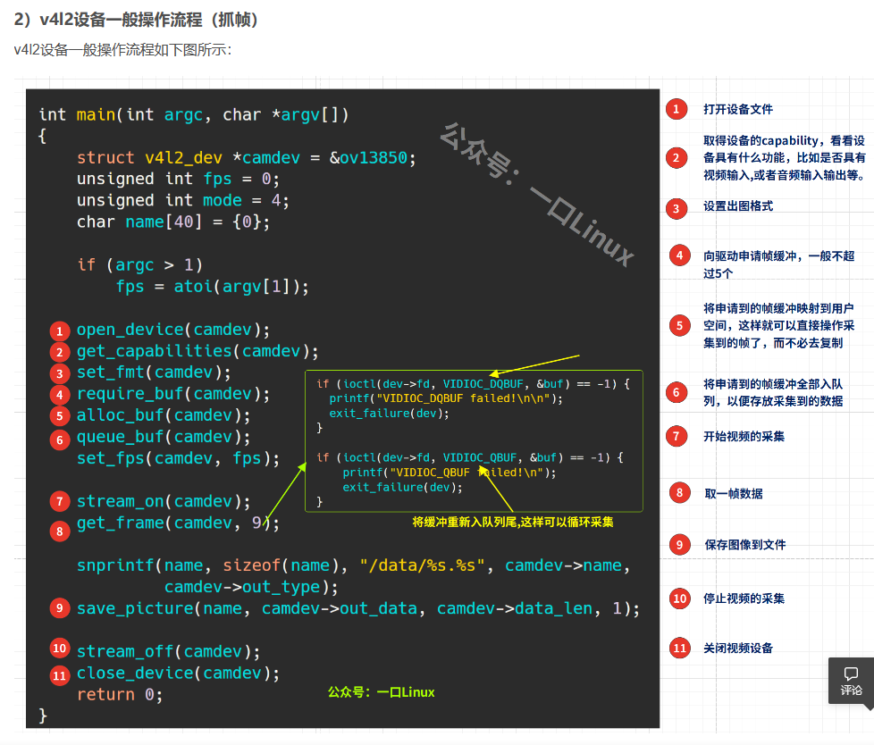